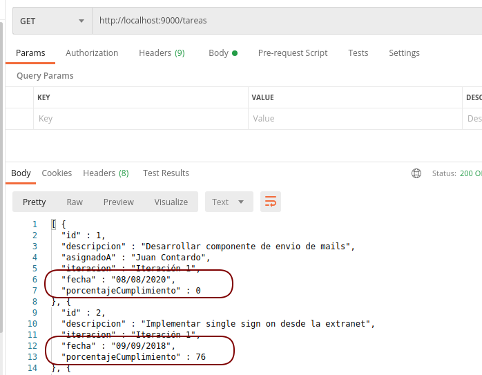

# Spring Boot - Tareas pendientes de un equipo de Desarrollo

[](https://github.com/uqbar-project/eg-tareas-springboot/actions/workflows/build.yml) [](https://codecov.io/gh/uqbar-project/eg-tareas-springboot-kotlin)

## Dominio

Este ejemplo permite actualizar y mostrar las tareas pendientes que tiene un equipo de desarrollo. Los objetos de dominio involucrados son:

- tareas, a las que le hacemos un seguimiento y las asignamos a
- usuarios, que tienen una lista de tareas asignadas


Vemos que hay una relación bidireccional entre Tarea y Usuario

## Servicios REST

En TareasApplication levantamos el servidor [Tomcat](https://tomcat.apache.org/).

```kt
@SpringBootApplication
class TareasApplication

fun main(args: Array<String>) {
    runApplication<TareasApplication>(*args)
}
```

Por defecto va a levantar en el puerto 8080, pero lo modificamos en el archivo application.properties:

`server.port=9000`

O bien con formato yml en el `application.yml`:

```yml
server:
  port: 9000
```

Los controllers que tenemos disponibles son UsuariosController y TareasController.


### Cómo levantar el servidor REST

Las opciones para probarlo (ya sea con POSTMAN o una aplicación cliente) son las siguientes:

- desde IntelliJ, seleccionar TareasApplication.kt y con botón derecho ejecutar la opción Run (Ctrl + Shift + F10)
- o bien desde la línea de comando (cmd/PowerShell/Git Bash o una terminal de Linux) ejecutar la siguiente instrucción

```
./gradlew bootRun
```

Entonces visualizarán en la consola el log del servidor levantado:

// TODO: Cambiar la imagen


### Rutas

Con un cliente HTTP como Postman, pueden disparar pedidos al servidor. Por ejemplo, para listar las tareas pendientes:

- Pedido GET
- URL http://localhost:9000/tareas


Pero también para ver los datos de una tarea en particular, como la que tiene el identificador 1 (que en Spring Boot se define como parámetro {id}):

- Pedido GET
- URL http://localhost:9000/tareas/1


Para modificar una tarea, podemos hacer un pedido PUT que contenga la nueva información de la tarea. Esto lo podemos hacer copiando el JSON que nos devuelve como respuesta la ruta http://localhost:9000/tareas/1 y pegándolo en el body de nuestro request PUT. El siguiente gif ilustra esta situación:


### Implementación

#### Objeto de dominio Tarea

Es interesante ver la definición **del objeto de negocio Tarea** ya que en lugar de publicar la propiedad fecha como un LocalDate, lo hace como String formateándolo a día/mes/año. Esto se logra mediante dos anotaciones: @JsonIgnore para el atributo fecha (para que el serializador no lo tome en cuenta), y @JsonProperty con el nombre de la propiedad a publicar. Vemos a continuación cómo es la definición en el código:

```kt
class Tarea : Entity() {
    ...
    
    @JsonIgnore
    var fecha = LocalDate.now()

    ...
    
    @JsonProperty("fecha")
    fun getFechaAsString() = formatter.format(this.fecha)
```

Del mismo modo, la propiedad asignatario se oculta para publicar otra llamada "asignadoA" que es un String:

```kt
class Tarea : Entity() {

    ...
    
    @JsonIgnore
    var asignatario: Usuario? = null

    @JsonProperty("asignadoA")
    fun getAsignadoA(): String = asignatario?.nombre.orEmpty()

    @JsonProperty("asignadoA")
    fun setAsignatario(nombreAsignatario: String) {
        asignatario = Usuario(nombreAsignatario)
    }

```

Surgen las preguntas: ¿por qué?, ¿es necesario?.

Probamos quitando la anotación `@JsonIgnore` que está al lado del atributo asignatario.

Y guardamos (no hace falta parar y volver a levantar la aplicación, gracias al LiveReload de Spring Boot).

Parece que va todo bien, hasta que volvemos a pedir las tareas desde Postman:


Jackson no puede serializar a JSON la lista de tareas pendientes: Se produce una recursión infinita dada la relación bidireccional entre Tarea y Usuario, generando `StackOverflowError`. En general se busca evitar tener relaciones bidireccionales, pero cuando esto no es posible hay que buscar otra solución.

En nuestro caso, decidimos ignorar el atributo "asignatario" para que el serializador no lo tome en cuenta (así se evita la recursión) y en su lugar publicamos la property "asignadoA" que devuelve el nombre del asignatario.

La solución utilizando annotations de Jackson (`@JsonProperty`, `@JsonIgnore`) requiere escribir mucho menos código, la solución es más declarativa. 

La declaratividad nos permite expresar "esta propiedad no la tomes en cuenta" o "esta propiedad se llama de esta otra manera", y delegar en un motor el algoritmo de serialización/deserialización. Esto es conveniente ya que tenemos que pensar en menos cosas, por otra parte tenemos menos control sobre el algoritmo, algo que en algunos casos podemos necesitar. Por otra parte, la clase de negocio Tarea no se ve ensuciada con anotaciones que necesita otro concern (el controller para devolver información).

Otra desventaja es que las anotaciones sirven para todos los casos, no es posible que un controller devuelva en ciertos casos el asignatario y en otros no, **siempre tenemos que devolver la misma información**.

## Otras alternativas a la hora de serializar

Además de las anotaciones que provee Jackson, contamos con otras variantes:

- DTO
- Custom Serializers

### DTO

El DTO o (Data Transfer Object), es un objeto que modela la transferencia de información de un ambiente a otro (en este caso el que expone la API para ser consumida por un cliente como POSTMAN o el frontend). La técnica es bastante simple:

- construimos un objeto TareaDTO y definimos atributos (y getters/setters) 

```kt
class TareaDTO {
    var id: Int? = null
    var descripcion = ""
}
```

Todos esos atributos formarán parte de lo que se expondrá de la Tarea, en los endpoints que lo usen.

```kt
fun buscar(@RequestBody tareaBusqueda: Tarea) =
    tareasService.buscar(tareaBusqueda).map { it.toTareaDTO() }
```

- además, tenemos que crear un método para convertir la información: de Tarea a TareaDTO.

```kt
fun toTareaDTO(): TareaDTO = TareaDTO().also {
    it.id = this.id
    it.descripcion = this.descripcion
}
```

#### Ventajas

- podemos configurar distintos DTO para que cada endpoint devuelva diferente información
- no ensuciamos con anotaciones de arquitectura al objeto de dominio

#### Desventajas

- hay más de un concepto acoplado a la Tarea, un cambio en la definición del negocio impacta ahora en más de un lugar (el objeto de dominio y sus DTOs)
- es necesario construir el algoritmo que convierte a los DTO

### Custom serializers

Una tercera opción consiste en definir un objeto que sepa serializar tareas, en base al serializador que nos provee por defecto Springboot:

```kt
class TareaSerializer : StdSerializer<Tarea>(Tarea::class.java) {
    
    override fun serialize(tarea: Tarea, gen: JsonGenerator, provider: SerializerProvider) {
        gen.apply {
            writeStartObject()
            if (tarea.id !== null) {
                writeNumberField("id", tarea.id)
            }
            writeStringField("descripcion", tarea.descripcion)
            if (tarea.asignatario !== null) {
                writeStringField("asignadoA", tarea.asignatario?.nombre)
            }
            writeStringField("iteracion", tarea.iteracion)
            writeStringField("fecha", DateTimeFormatter.ofPattern("dd/MM/yyyy").format(tarea.fecha))
            writeNumberField("porcentajeCumplimiento", tarea.porcentajeCumplimiento)
            writeEndObject()
        }
    }

}
```

En la clase Tarea, le asociamos nuestro serializador _custom_:

```kt
@JsonSerialize(using=TareaSerializer::class)
class Tarea : Entity() {
```

Esto nos permite devolver la lista de tareas satisfactoriamente, porque generamos un JSON propio. Tenemos un gran control sobre el algoritmo de serialización. Podemos alterar el orden en el que construimos cada atributo, por ejemplo podemos alternar las líneas fecha y porcentajeCumplimiento:

```kt
    writeStringField("fecha", DateTimeFormatter.ofPattern("dd/MM/yyyy").format(tarea.fecha))
    writeNumberField("porcentajeCumplimiento", tarea.porcentajeCumplimiento)
```

Y eso produce el cambio en nuestro output:



Tener serializadores también sustituye la necesidad de manejar las anotaciones en el objeto de dominio, y es una solución todavía más verbosa que la del DTO: requiere muchas más líneas de código, para saber por ejemplo cómo deserializar la información que viene en formato JSON

```kt
class TareaDeserializer : StdDeserializer<Tarea>(Tarea::class.java) {

    @Autowired
    lateinit var usuariosRepository: UsuariosRepository

    override fun deserialize (parser: JsonParser, context: DeserializationContext): Tarea {
        val node = parser.readValueAsTree() as TreeNode
        return Tarea().apply {
            val nodoId = node.get("id") as IntNode?
            if (nodoId !== null) {
                id = nodoId.asInt()
            }
            descripcion = (node.get("descripcion") as TextNode).asText()
            iteracion = (node.get("iteracion") as TextNode).asText()
            val nodoPorcentaje = node.get("porcentajeCumplimiento") as IntNode?
            if (nodoPorcentaje !== null) {
                porcentajeCumplimiento = nodoPorcentaje.asInt()
            }
            val nodoAsignatario = node.get("asignadoA") as TextNode?
            if (nodoAsignatario !== null) {
                asignatario = usuariosRepository.getAsignatario(nodoAsignatario.asText())
            }
            val nodoFecha = node.get("fecha") as TextNode?
            if (nodoFecha !== null) {
                fecha = LocalDate.parse(nodoFecha.asText(), Tarea.formatter)
            }
        }
    }
}
```

Y también hay que configurarlo en la clase Tarea:

```kt
@JsonSerialize(using=TareaSerializer::class)
@JsonDeserialize(using=TareaDeserializer::class)
class Tarea : Entity() {
```

El deserializador necesita manejar correctamente

- la relación bidireccional Tarea/Usuario que puede hacernos entrar en loop si mantenemos serializadores por defecto y sin annotations
- la fecha (si intentamos usar el serializador de fechas por defecto nos aparecerá un error bastante feo)

La solución es un poco áspera, porque tenemos que convertir el JSON a un tipo concreto: String, int, fecha, Usuario. Nuevamente, lo interesante es tener varias soluciones para poder compararlas.

## Controllers de Tarea - GET

Veamos los métodos get:

```kt
@GetMapping("/tareas")
@ApiOperation("Devuelve todas las tareas")
fun tareas(): List<Tarea> {
    return tareasService.tareas()
}

@GetMapping("/tareas/{id}")
@ApiOperation("Permite conocer la información de una tarea por identificador")
fun tareaPorId(@PathVariable id: Int): Tarea {
    return tareasService.tareaPorId(id)
}
```

La annotation @GetMapping("/tareas") define

- que utilizará el método http GET
- para la ruta "/tareas" desde el servidor donde se publique el _jar_ (por eso para invocarla desde Postman es http://localhost:9000/tareas)

La búsqueda 1) se delega primero al service y luego al repositorio, y la respuesta 2) se serializa a JSON en base a las definiciones del objeto de negocio (usando una instancia del ObjectMapper de Jackson). Por último, 3) el método ok devuelve un estado http 200 + el JSON con la lista de tareas.

En el caso de la búsqueda específica, los códigos de respuesta http son:

- `200`: si todo sale ok
- `400 - bad request`: faltan parámetros
- `404 - not found`: si buscamos una tarea cuyo identificador no existe
- `500 - internal server error`: será un error de programación

Esto lo podemos ver en los tests.

## Controllers de Tarea - PUT

Ahora veremos el método que permite actualizar una tarea:

```kt
@PutMapping("/tareas/{id}")
@ApiOperation("Permite actualizar la información de una tarea")
fun actualizar(@PathVariable id: Int, @RequestBody tareaBody: Tarea): Tarea {
    return tareasService.actualizar(id, tareaBody)
}
```

La annotation @PutMapping define la ruta "/tareas/{id}" como método http PUT. Los parámetros que se le inyectan son:

- el identificador o id, dentro de la ruta, puesto entre llaves ({id}). Para el caso de http://localhost:9000/tareas/2, el valor 2 se asigna al parametro id del método actualizar. La anotación @PathVariable indicá que el paramétro id va a estar ligado a un parámetro de la URL.
- por otra parte, la annotation @RequestBody dentro del parámetro del método actualizar permite recibir un JSON y asignarlo a la variable body.

La implementación del método actualizar requiere transformar el body (JSON) al objeto Tarea. Así como agregamos dos properties para la serialización de una Tarea (fecha y asignadoA), agregamos una property para la deserialización de la fecha pero no para el asignatario, porque hay que buscarlo en el repo (y no queremos hacerlo desde la clase Usuario).

La property fecha va a asignarle al atributo fecha la fecha que vino (como String) convertida a LocalDate.

El service a su vez

- verifica que la información sea consistente (parámetro de la URL e información dentro del body)
- se recupera la información de la tarea del repositorio (que es nuestra _source of truth_)
- pisamos los valores que tenemos del repo con la información que nos pasaron (incluyendo el asignatario si existe)
- delegamos en el objeto de dominio la validación
- delegamos al repositorio actualizar la información
- y opcionalmente devolvemos la tarea actualizada

```kt
fun actualizar(id: Int, tareaActualizada: Tarea): Tarea {
    if (tareaActualizada.id !== null && tareaActualizada.id !== id) {
        throw BusinessException("Id en URL distinto del id que viene en el body")
    }
    val tarea = tareaPorId(id)
    val nombreAsignatario = tareaActualizada.asignatario?.nombre
    // Solo llamamos a getAsignatario si el nombre contiene un valor distinto de null
    tareaActualizada.asignatario = nombreAsignatario?.let { usuariosRepository.getAsignatario(it) }
    tarea.actualizar(tareaActualizada)
    tarea.validar()
    tareasRepository.update(tarea)
    return tarea
}
```

Una vez que se actualiza, se envía el status 200 y la tarea actualizada serializada a JSON. En caso de haber un error de negocio lanzamos una excepción que se convierte a un status 400 (Bad Request) con la informacón del error. Cualquier otra excepción que no es del negocio, es un error de programa, corresponde devolver 500 (internal server error), que es lo que va a devolver Spring Boot por defecto.

## Manejo de errores

Una cosa interesante es que cuando el service valida que una tarea exista:

```kt
fun tareaPorId(id: Int): Tarea = tareasRepository.searchById(id) ?: throw NotFoundException("No se encontró la tarea de id <$id>")

```

la excepción NotFoundException se asocia a un código de respuesta 404:

```xtend
@ResponseStatus(HttpStatus.NOT_FOUND)
class NotFoundException(msg: String) : RuntimeException(msg) {
}
```

de la misma manera que se modela una excepción de negocio (BusinessException) como BadRequest.

### Variante con exception handlers

Otra forma de modelar esto es dejar las excepciones sin anotaciones, y definir una clase exception handler que le avise a Springboot cómo debe actuar en caso de recibir una excepción:

```xtend
@Order(Ordered.HIGHEST_PRECEDENCE)
@ControllerAdvice
class RestExceptionHandler : ResponseEntityExceptionHandler {

  @ExceptionHandler(BusinessException)
  fun handleBusinessException(e: BusinessException) {
    ResponseEntity.badRequest.body(e.message)
  }

  @ExceptionHandler(NotFoundException)
  fun handleNotFoundException(e: NotFoundException) {
    ResponseEntity.status(HttpStatus.NOT_FOUND).body(e.message)
  }

  @ExceptionHandler(Exception)
  fun handleException(e: Exception) {
    ResponseEntity.status(HttpStatus.INTERNAL_SERVER_ERROR).body(e.message)
  }

}
```

De la misma manera que vamos desde excepciones más particulares a más generales, el exception handler va definiendo comportamiento para cada una de las excepciones a partir de métodos `handleException`.

## Diagrama general de la arquitectura


## Testing

En la carpeta src/test/java podrás encontrar los casos de prueba para los controllers. Por ejemplo, para la búsqueda de una tarea puntual tendremos los siguientes escenarios:

- una búsqueda de una tarea que existe, debe devolver toda la información de la tarea
- una búsqueda de una tarea que no existe, debe devolver código 404 (not found). Chequear por el mensaje de error específico puede ser contraproducente para hacerlo mantenible, solo lo dejamos con fines didácticos (en una aplicación comercial podría ser mejor no agregar ese assert)
- una búsqueda sin id, debe devolver código 400 (bad request).

## Para testearlo en Insomnia

Tenés [este json](./Insomnia_tareas.json) que podés importar en Insomnia:

- Application > Preferences > luego abrir la solapa Data
- Presionar el botón Data > From File
- Seleccionar este archivo, la carpeta de Insomnia se llama Tareas
